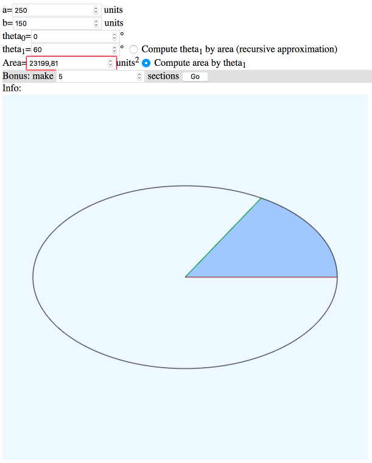
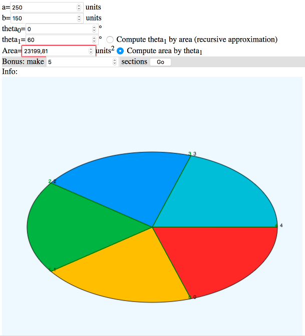

# Area of an Ellipse

This script :
```
 (i)   Computes the area of an ellipse.
 (ii)  Computes the area of an elliptic section based on an angle.
 (iii) Computes the area of an elliptic section based on a start and an end angle.
 (iv)  Computes a section's angle based on a start angle and a given area.
```







Here is the [Demo](http://int2byte.de/public/area-of-ellipse/main.html)

